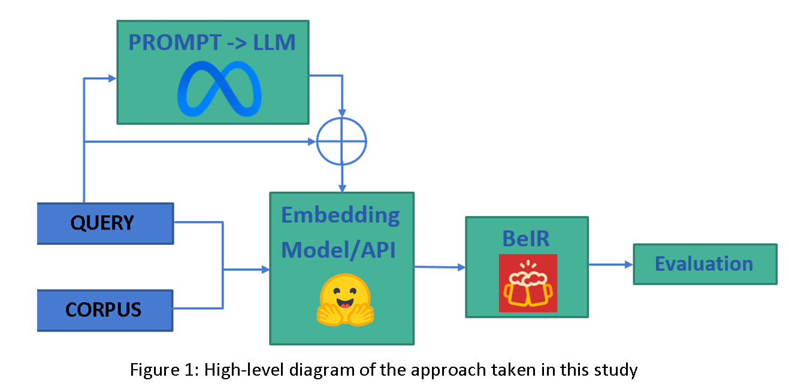
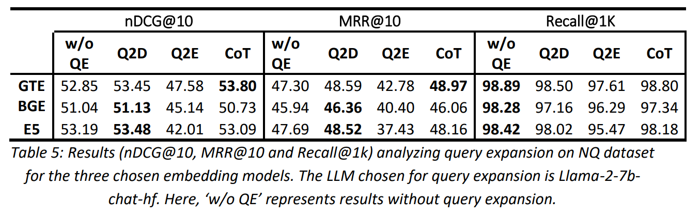
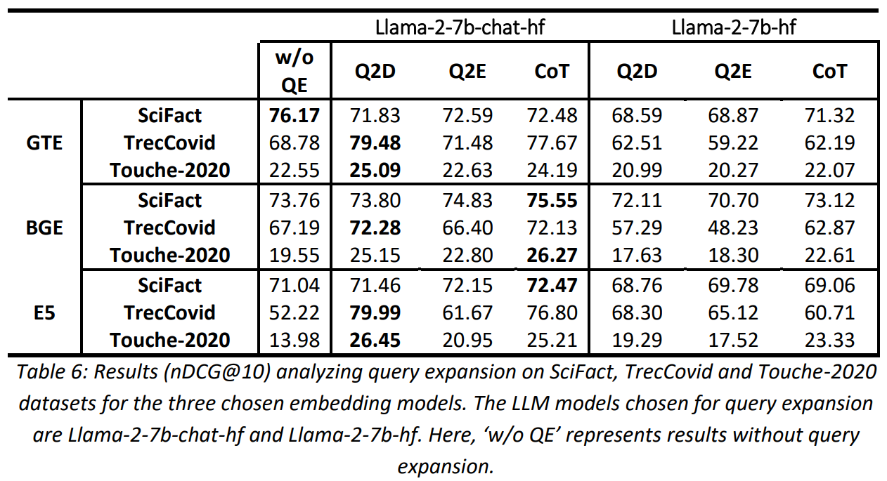
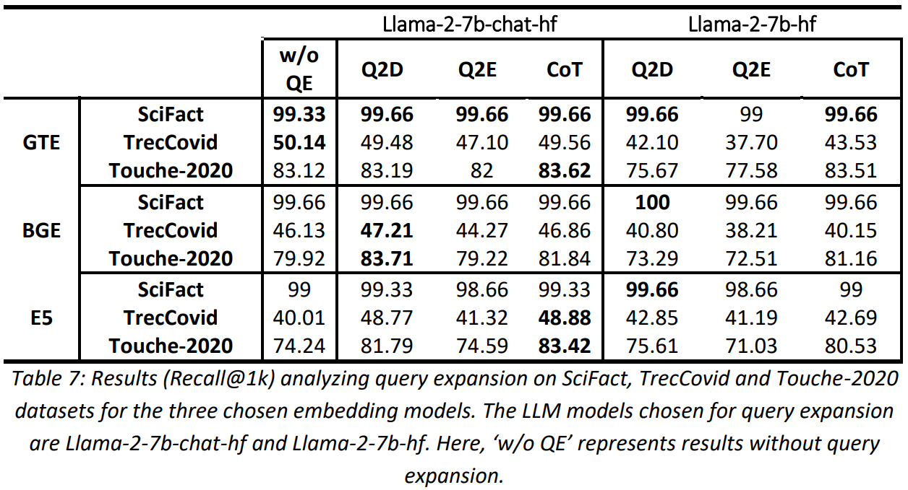

# Evaluate Embeddings
This repository contains the code and results for the Query Expansion portion of [This Paper](https://drive.google.com/file/d/10xBOwAYMxlGfQgf10AtbdlyrTRuNm95z/view?usp=drive_link) on a Comprehensive Evaluation of Embedding Models and Unraveling the Impact of Query Expansion.

## Introduction
This study focused on the vital role text embeddings play in information retrieval. The [BeIR](https://github.com/beir-cellar/beir) benchmark, known for its rigorous evaluation, serves as a fertile ground for comparative analysis. This study examines the performance of three prominent open-source embedding models — gte-base, bge-base-en-v1.5, and e5-base-v2 — within the BeIR framework. Beyond conventional evaluation, the study delves into the nuanced realm of query expansion and its impact on information retrieval. Using Language Models (LLMs) for query expansion, a technique aiming to enhance search results by supplementing the original query with relevant terms is explored. The study focuses on a zero-shot prompt response generation technique, specifically Q2D, Q2E, and CoT. Utilizing LLMs as the backbones of dense retrieval, the dense retrieval concatenation technique is used to generate the new query for retrieval.
The results of the evaluation of these expanded queries on the three embedding models are given below while the code can be found [here](https://github.com/Maham-Mukaram/evaluating-embeddings).



## Quickstart

### 1. Prerequisites

Our code can be compiled on Python 3 environments. The modules used in our code can be installed using:
```
$ pip install -r requirements
```

### 2. Expanding Queries

The top 100 original and expanded queries of the Natural Questions dataset [Datasets/nq](Datasets/nq) are included in the repository. You can download these datasets using the [BeIR Download Datasets file](https://github.com/beir-cellar/beir/blob/main/examples/dataset/download_dataset.py). The tasks/datasets defined in the code are:
```
TASK_LIST = [
    "arguana",
    "cqadupstack/android",
    "cqadupstack/english",
    "cqadupstack/gaming",
    "cqadupstack/gis",
    "cqadupstack/mathematica",
    "cqadupstack/physics",
    "cqadupstack/programmers",
    "cqadupstack/stats",
    "cqadupstack/stats",
    "cqadupstack/tex",
    "cqadupstack/unix",
    "cqadupstack/webmasters",
    "cqadupstack/wordpress",
    "fiqa",
    "nfcorpus",
    "nq",
    "scidocs",
    "scifact",
    "webis-touche2020",
    "trec-covid"
]
```
You can use 'startid' and 'endid' arguments to better define which tasks within the TASK_LIST you want to run the query expansion for. So for example, for the Natural Questions dataset set:
```
--startid=16 \
--endid=17
```
There are three prompts you can choose from using the 'prompttype' argument:
  1. **Q2D:**
     > Write a passage that answers the following query: {query}
  3. **Q2E:**
     > Write a list of keywords for the following query: {query}
  5. **CoT:**
     >Answer the following query:  
     >{query}  
     >Give the rationale before answering

The study used the Llama LLMs to generate responses for the given prompts. Two models were used:
1. [meta-llama/Llama-2-7b-hf](https://huggingface.co/meta-llama/Llama-2-7b-hf)
2. [meta-llama/Llama-2-7b-chat-hf](https://huggingface.co/meta-llama/Llama-2-7b-chat-hf)

These models generate a response in the format of "Prompt"+"Prompt Answer". [Get_QueryExpanded_Split](Get_QueryExpanded_Split.py) attempts to split the response to just get "Prompt Answer" from the generated response before concatenating with the original query. [Get_QueryExpanded](Get_QueryExpanded.py) can be used if you don't require any splitting.

To run an expansion on the nq dataset present inside the datasets folder, please use the following command:
```
$ python Get_QueryExpanded.py \
	--startid=16 \
	--endid=17 \
	--engine=meta-llama/Llama-2-7b-chat-hf \
	--prompttype=Q2E \
	--datapath=Datasets
```
The maximum length of LLM response is kept at 200 and top_k=10.

### 3. Results
#### Original Query  
>who makes history the leader or the mass movement
#### Q2D
>who makes history the leader or the mass movement ?
>
>History is made by both leaders and mass movements. Leaders, such as political figures, activists, and innovators, play a significant role in shaping historical events and leaving their mark on society. They provide vision, direction, and inspiration to others, often through their words and actions. On the other hand, mass movements, such as social and political movements, are driven by the collective action of ordinary people who come together to demand change. These movements often emerge in response to social, economic, or political injustices and can lead to significant transformations in society.
>
>In some cases, leaders and mass movements work together to create historical change. For example, the Civil Rights Movement in the United States was led by figures such as Martin Luther King Jr., but it was also driven by the collective action of ordinary people who participated in protests, boycot
#### Q2E  
>"who makes history the leader or the mass movement ?
>
>1. Leader
>2. Mass movement
>3. Revolution
>4. Activism
>5. Protest
>6. Social change
>7. Politics
>8. Power
>9. Resistance
>10. Revolutionary
#### CoT  
>who makes history the leader or the mass movement  the question.
>History is created by the actions of individuals, groups, and societies. While some individuals and groups may play a more significant role in shaping historical events, the mass movement of people can also significantly influence history.
>
>The answer to the question depends on how one defines history and leadership. If leadership is defined as the ability to shape and direct historical events, then individuals or groups may be considered the leaders of history. However, if leadership is defined as the ability to mobilize and organize people towards a common goal, then the mass movement of people may be considered the leader of history.
>
>In some cases, individuals or groups may lead mass movements, such as civil rights movements, anti-war movements, or socialist revolutions. These leaders may inspire and organize people to take action, mobilizing them towards a common goal. However

#### Evaluations




